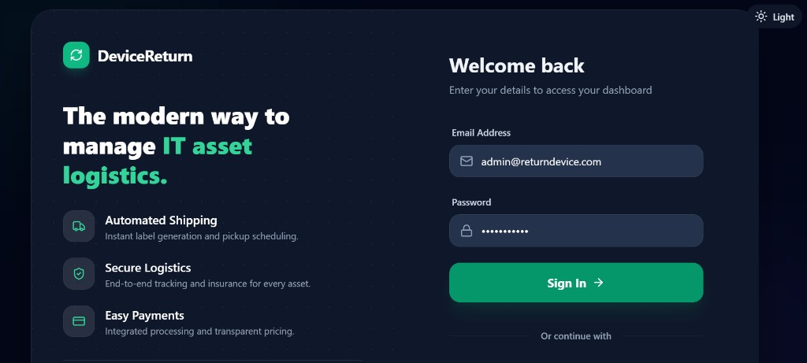
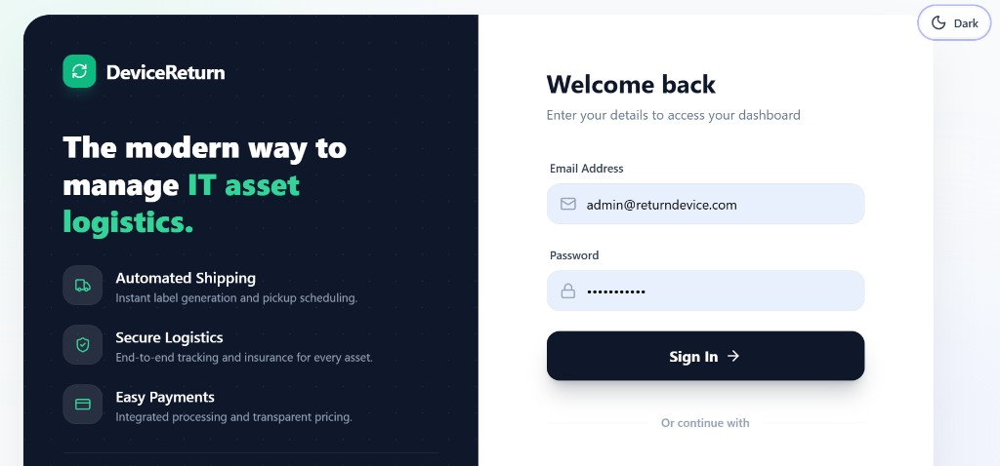
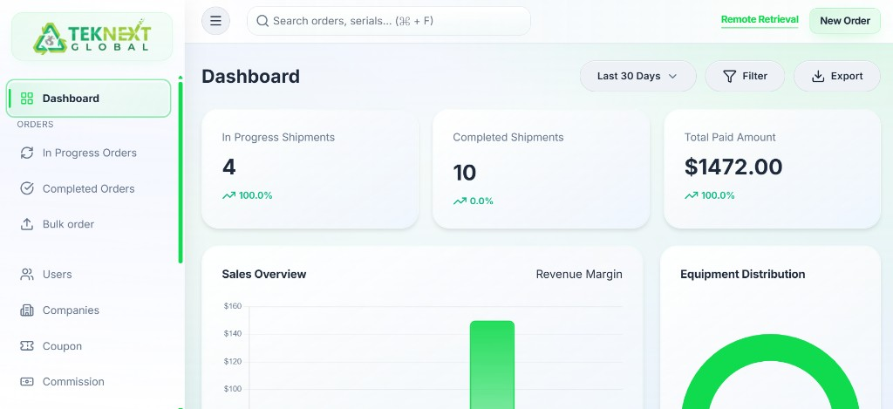
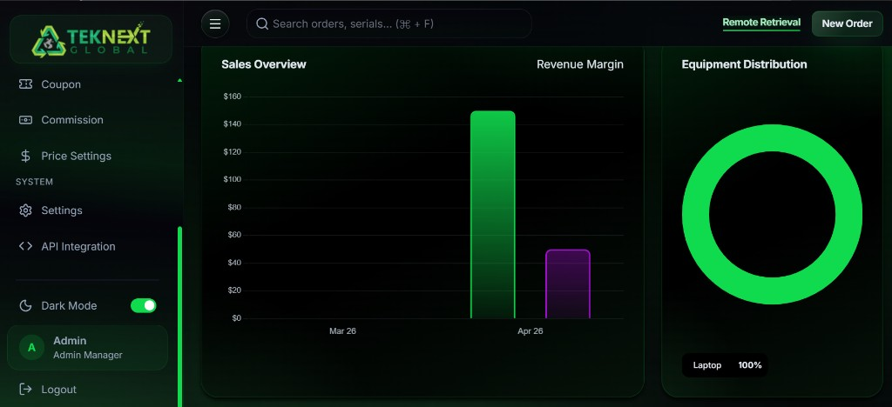

# DeviceReturn

### SaaS Device Recovery Platform

`Laravel 10` `React` `TypeScript` `Vite` `Tailwind CSS` `MySQL` `Docker Ready`

DeviceReturn is a full-stack multi-tenant SaaS platform that automates end-to-end device recovery, from employee onboarding and shipping label generation to payment processing and order tracking.

Built with Laravel for backend business logic and a modern React dashboard for daily operations.

---

## Demo

<p align="center">
  
  
</p>

<p align="center">
  
  
</p>

---

## Features

### Dashboard & Analytics
- Real-time KPI cards (total orders, in-progress, completed, revenue)
- Interactive charts for order and revenue trends
- Company-level and system-level visibility

### Multi-Tenant Company Management
- White-label setup with per-company branding (logo, colors, favicon)
- Company onboarding with recipient and employee management
- Custom company pricing and commission rules

### Order Lifecycle Management
- Single order creation and bulk CSV import
- Full order journey from `Pending` to `Completed`
- Detailed order page with editable employee/device fields

### Shipping & Label Generation
- Shippo integration for UPS/USPS/FedEx label generation
- Automatic tracking number capture
- PDF label support

### Payment Processing
- PayPal Payflow Pro integration
- Insurance cost support
- Coupon and discount workflows

### User & Access
- Role-based auth (Admin, Company User)
- Laravel auth stack with API support
- User CRUD and company assignment

### Notifications
- Status-based email triggers
- SMS tracking updates
- BCC support for audit workflows

### API & Settings
- API endpoints for third-party integrations
- API key management
- Global and per-company settings

---

## Tech Stack

| Layer | Technology |
| --- | --- |
| Backend | PHP 8.1, Laravel 10, Eloquent ORM |
| Frontend | React, TypeScript, Vite, TailwindCSS |
| Database | MySQL 8 |
| Payments | PayPal Payflow Pro |
| Shipping | Shippo API |
| PDF | DomPDF |
| Auth | Laravel auth + API token flow |
| DevOps | Docker, Docker Compose, Vite HMR |

---

## Quick Start

### Prerequisites
- PHP 8.1+
- Composer 2+
- Node.js 18+
- MySQL 8+

### Local Setup

```bash
# 1) Clone
git clone https://github.com/Gustav1814/return-device.git
cd return-device

# 2) Install dependencies
composer install
npm install

# 3) Environment
cp .env.example .env
php artisan key:generate

# 4) Database
php artisan migrate

# 5) Start app
php artisan serve
npm run dev
```

Open `http://localhost:8000/saas`.

---

## Docker Setup

```bash
git clone https://github.com/Gustav1814/return-device.git
cd return-device
docker-compose up --build -d
docker-compose exec app composer install
docker-compose exec app cp .env.example .env
docker-compose exec app php artisan key:generate
docker-compose exec app php artisan migrate
docker-compose exec app npm install
docker-compose exec app npm run build
```

App URL: `http://localhost:8000`

Stop services:

```bash
docker-compose down
```

---

## Project Structure

```text
app/                   Controllers, models, services
config/                Laravel configuration
database/migrations/   Schema history
resources/js/react/    React SPA screens and components
resources/views/       Blade views
routes/                Web, API, auth routes
public/                Public assets
docs/screenshots/      README demo images
```

---

## Environment Variables

Set these in `.env`:

- `DB_*` for MySQL connection
- `PAYFLOW_*` for PayPal credentials
- `SHIPPO_PRIVATE` for shipping labels
- `MAIL_*` for email delivery
- `CURR_DOMAIN` for white-label domain handling
- `INSURANCE_RATE`, `ORDER_AMT`, `LABEL_CARRIER` for pricing/shipping defaults

---

## Development Commands

```bash
php artisan test
npm run build
php artisan migrate:fresh --seed
```

---

## Portfolio Note

This repository is a portfolio-safe version.  
Sensitive credentials and private company configuration are excluded.
